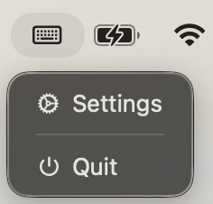
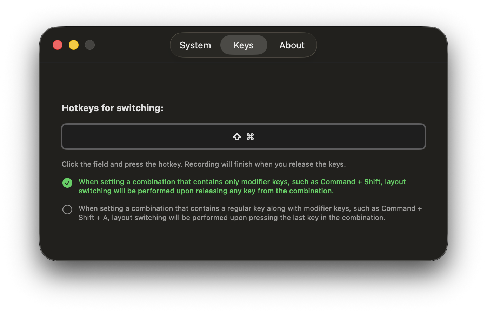

<!-- https://github.com/othneildrew/Best-README-Template -->
<div align="center">
  <a href="https://github.com/BugsBag/Bublik">
    
  </a>

  <h3 align="center">Bublik</h3>

<p align="center">
    A lightweight, native macOS utility for keyboard layout switching.
    <br />
    <br />
    
    
    <a href="./LICENSE">
      
    </a>
    <a href="https://github.com/BugsBag/Bublik/releases/latest">
      
    </a>
  </p>
</div>

## About The Project

> [!WARNING]
> Bublik is still under development and may contain bugs and errors, but is generally ready for use.

**Bublik** ("bagel/donut") is a minimalist tool for switching keyboard layouts in macOS.

### Key Features:

- **Custom Hotkeys**: Support for both standard combinations (e.g., Cmd + Shift + A) and modifier-only switching (e.g., just Cmd + Shift).
- **Privacy-Focused**: Open-source and transparent. No data collection, just switching.

## Installation

Since **Bublik** is currently distributed without a paid Apple Developer certificate, macOS Gatekeeper will block it by default. Follow these steps to get it running:

1.  **Download** the latest `Bublik_Installer.dmg` from the [Releases](https://github.com/BugsBag/Bublik/releases/latest) page.
2.  **Open** the downloaded DMG file.
3.  **Drag** `Bublik.app` to your **Applications** folder.
4.  **Remove Quarantine:** Open your terminal and run the following command to allow the app to run:
    ```bash
    xattr -cr /Applications/Bublik.app
    ```
5.  **Permissions:** Upon first launch, the app will ask for **Accessibility Access**. This is required to intercept keyboard events and switch layouts. Without these permissions, the application will not have access to keyboard events.
6.  **Activate:** Open the settings from the menu bar and restart the app from the **System** tab to apply all settings correctly.

## Usage & Configuration

Setting up **Bublik** takes less than a minute. Follow these steps:

### 1. Access Settings

After launching the app, find the keyboard icon in your macOS Menu Bar. Click it and select **Settings...** to configure the app.

<p align="center">
  
</p>

### 2. Configure Your Hotkey

Go to the **Keys** tab. Click on the recording field and press the key combination you want to use for switching layouts.

<p align="center">
  
</p>

- **Modifier-only**: You can set combinations like `Cmd + Shift`. Switching happens when you **release** the keys.
- **Complex combos**: Combinations like `Cmd + Shift + A` trigger immediately upon pressing the final key.

### 3. Additional Options

In the **System** tab, you can enable **Launch at Login** so Bublik is always ready when you Log in to your profile. You can also change the application language here.

## Build

Don't trust the developer build? No problem! Build Bublik yourself on your Mac.

Open any terminal application and run the commands below.

```sh
# clone the Bublik repository
git clone https://github.com/BugsBag/Bublik
# go to directory
cd Bublik
# grant execute permissions to the application build script
chmod +x ./scripts/build.sh
# of course, before executing the script, you need to review it
# after review run it for build
./scripts/build.sh
# after the build, a tmp folder will be created with files ready for distribution.
# copy the compiled Bublik.app to your Applications folder
ditto ./tmp/dmg_folder/Bublik.app /Applications/Bublik.app
# remove quarantine
xattr -cr /Applications/Bublik.app
```

That's all. Launch the app and grant the requested permissions for it to work properly. Open Settings from the menu bar and restart the app in the System tab where the requested permissions were granted.

## License

Distributed under the **GPLv3 License**. See `LICENSE` for more information. This ensures the project remains free and open-source for everyone.

## Author

**Igor V.** GitHub: [@BugsBag](https://github.com/BugsBag)

_If you find **Bublik** useful, feel free to give it a ⭐ on GitHub\!_
